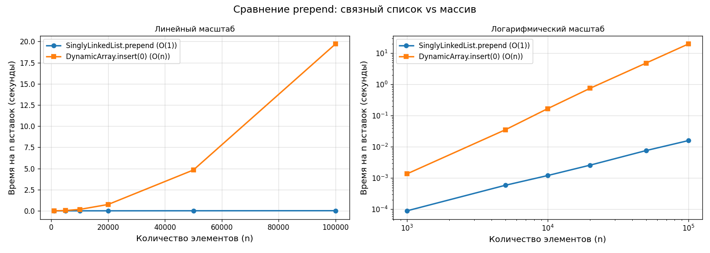
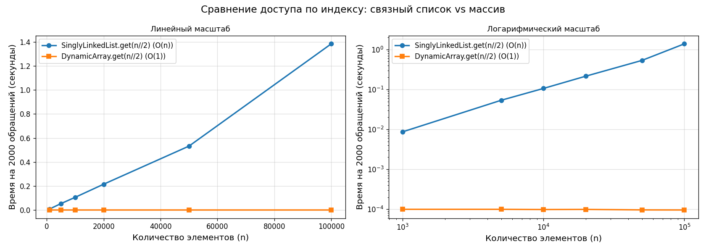

<div align="center">

# 🔗 Связные списки

**Лабораторная работа № 2** · Алгоритмы и структуры данных

Работа со связным списком: добавление, удаление, поиск элементов

<br>


</div>

---

## Содержание

| Раздел | Что внутри |
|--------|-----------|
| [🎯 Задание](#-задание) | Три уровня и что по ним сдано |
| [🚀 Быстрый старт](#-быстрый-старт) | Как запустить тесты и замеры |
| [📁 Структура проекта](#-структура-проекта) | Какой файл за что отвечает |
| [🥉 Бронза](#-бронза--односвязный-список) | Односвязный список |
| [🥈 Серебро](#-серебро--двусвязный-список) | Двусвязный список |
| [🥇 Золото](#-золото--замеры-производительности) | Замеры, графики, показатели роста |
| [📊 Выводы](#-выводы) | Что показали эксперименты |
| [📋 Сравнительная таблица](#-сравнительная-таблица-домашнее-задание) | Домашнее задание |
| [✅ Тесты](#-тесты) | Что именно проверяется |

---

## 🎯 Задание

| | Уровень | Требуется | Статус |
|:--:|---------|-----------|:------:|
| 🥉 | **Бронза** | `Node` и `SinglyLinkedList`: `prepend` O(1), `append` O(n), `find`, `delete`, `__len__`, `__str__` | ✅ |
| 🥈 | **Серебро** | `DoublyLinkedList`: `prepend`/`append` O(1) с `tail`, `find`, `delete`, `get(index)`, `reverse()` | ✅ |
| 🥇 | **Золото** | Замерить `prepend` и `get(n/2)` для списка vs массива, построить графики, сделать выводы | ✅ |
| 📋 | **Домашнее** | Заполнить сравнительную таблицу сложностей | ✅ |

---

## 🚀 Быстрый старт

```bash
# Тесты — проверка корректности всех трёх структур
python3 test_lists.py

# Замеры золотого уровня (~30 секунд, размеры n до 100 000)
python3 benchmark.py

# Быстрый прогон на малых размерах
python3 benchmark.py --quick

# Только сохранить графики, не открывать окна
python3 benchmark.py --no-show
```

> **Зависимость:** для замеров нужен `matplotlib` — `pip install matplotlib`.
> Графики сохраняются в каталог `results/`.

---

## 📁 Структура проекта

```
dsa-lab-02/
├── singly_linked_list.py    🥉 Node, SinglyLinkedList
├── doubly_linked_list.py    🥈 DNode, DoublyLinkedList
├── dynamic_array.py         🥇 DynamicArray — оппонент списка в замерах
├── benchmark.py             🥇 эксперименты, графики, выводы
├── test_lists.py            ✅ тесты самопроверки
└── results/
    ├── prepend.png          📈 график эксперимента 1
    └── get_middle.png       📈 график эксперимента 2
```

---

## 🥉 Бронза — односвязный список

Узел хранит данные и ссылку на следующий. Последний узел ссылается на `None` — это и есть конец списка.

```
head
 │
 ▼
┌────┬───┐   ┌────┬───┐   ┌────┬──────┐
│ 20 │ ●─┼──▶│ 10 │ ●─┼──▶│ 30 │ None │
└────┴───┘   └────┴───┘   └────┴──────┘
  ▲    ▲
data  next
```

### Операции

| Операция | Сложность | Как работает |
|----------|:---------:|--------------|
| `prepend(data)` | **O(1)** | новый узел → его `next` на старый `head` → `head` на новый узел |
| `append(data)` | O(n) | идём от `head` до конца, прицепляем узел (`tail` не хранится) |
| `find(data)` | O(n) | идём по ссылкам и сравниваем `data`, возвращаем узел или `None` |
| `delete(data)` | O(n) | ищем **предыдущий** узел и перекидываем его `next` через удаляемый |
| `get(index)` | O(n) | делаем `index` переходов по ссылкам |

### Пример

```python
from singly_linked_list import SinglyLinkedList

sll = SinglyLinkedList()
sll.prepend(10)
sll.prepend(20)
sll.append(30)

print(sll)          # 20 -> 10 -> 30 -> None
print(len(sll))     # 3
print(sll.find(10)) # Node(10)
print(sll.find(99)) # None

sll.delete(10)
print(sll)          # 20 -> 30 -> None
```

---

## 🥈 Серебро — двусвязный список

У узла появляется ссылка `prev` на предыдущий, у списка — указатель `tail` на конец.

```
  head                          tail
   │                             │
   ▼                             ▼
┌──────┐       ┌──────┐       ┌──────┐
│  10  │◀─────▶│  20  │◀─────▶│  30  │
└──────┘       └──────┘       └──────┘
```

У каждого узла две ссылки: `prev` — на предыдущий, `next` — на следующий.
У `head` ссылка `prev` равна `None`, у `tail` ссылка `next` равна `None`.

### Что это даёт

| Выигрыш | Почему |
|---------|--------|
| `append` за **O(1)** | конец известен из `tail`, идти до него не нужно |
| `delete_node` за **O(1)** | предыдущий узел уже лежит в `prev`, искать его не надо |
| `reverse()` за O(n) | у каждого узла меняются местами `prev` и `next`, затем меняются местами `head` и `tail` |
| `get(index)` вдвое короче | обход начинается с того конца, который ближе к индексу (асимптотика остаётся O(n)) |

> ⚠️ `delete(data)` **по значению** остаётся O(n) — быстрый здесь только сам момент удаления,
> а узел всё равно приходится сначала найти. O(1) даёт именно `delete_node(node)`, когда узел уже на руках.

### Операции

| Операция | Сложность | Комментарий |
|----------|:---------:|-------------|
| `prepend(data)` | **O(1)** | связать с `head`, обновить `head` |
| `append(data)` | **O(1)** | связать с `tail`, обновить `tail` |
| `find(data)` | O(n) | обход от `head` |
| `delete(data)` | O(n) | поиск + перекидывание `prev.next` и `next.prev` |
| `delete_node(node)` | **O(1)** | удаление по готовой ссылке |
| `get(index)` | O(n) | обход с ближнего конца |
| `reverse()` | O(n) | разворот на месте, без выделения новой памяти |

### Пример

```python
from doubly_linked_list import DoublyLinkedList

dll = DoublyLinkedList([10, 20, 30])
print(dll)                   # 10 <-> 20 <-> 30 <-> None
print(dll.head.data, dll.tail.data)   # 10 30

dll.reverse()
print(dll)                   # 30 <-> 20 <-> 10 <-> None

dll.delete_node(dll.find(20))   # удаление по ссылке — O(1)
print(dll)                   # 30 <-> 10 <-> None

print(list(dll))             # [30, 10]
print(list(reversed(dll)))   # [10, 30]  — обход в обратную сторону
```

### Тонкости, которые проверяются тестами

- `__str__` пустого списка возвращает `"None"`;
- при удалении первого или последнего элемента обновляются `head` и `tail`;
- у единственного узла `head is tail`, а после его удаления оба сбрасываются в `None`;
- все операции добавления и удаления меняют `_size`;
- после `reverse()` список остаётся связным **в обе стороны** и с ним можно работать дальше.

---

## 🥇 Золото — замеры производительности

Оппонентом списка выступает `DynamicArray` — массив, который хранит элементы в непрерывном
блоке фиксированной ёмкости и удваивает её при переполнении.

```python
from dynamic_array import DynamicArray

arr = DynamicArray([1, 2, 3])
arr.insert(0, 0)     # O(n) — сдвиг всего хвоста вправо
arr.append(4)        # O(1) амортизированно
print(arr, arr.get(2), arr.capacity)   # [0, 1, 2, 3, 4] 2 8
```

> 📐 **О методике.** Сдвиг хвоста в `insert` выполнен присваиванием срезом — это тот же
> `memmove` непрерывного блока, который делает настоящий динамический массив на уровне C:
> объём работы линеен по числу сдвигаемых элементов. Время замера адаптивное: прогоны
> повторяются, пока не наберётся 50 мс, и берётся минимальный — так короткая операция
> успевает «прогреться», а помехи от планировщика ОС не искажают результат.

Условия: Python 3.13, размеры `n` из задания.

### Эксперимент 1 — `prepend`: n вставок в начало

<div align="center">

| n | 🔗 Список, с | 📦 Массив, с | Массив медленнее |
|--------:|---------:|----------:|---------:|
| 1 000 | 0.0001 | 0.0014 | 15x |
| 5 000 | 0.0006 | 0.0353 | 60x |
| 10 000 | 0.0012 | 0.1676 | 139x |
| 20 000 | 0.0026 | 0.7503 | 289x |
| 50 000 | 0.0076 | 4.8207 | 634x |
| **100 000** | **0.0159** | **19.7029** | **1242x** |

</div>



| Структура | Измерено | Ожидалось | Сходится |
|-----------|:--------:|:---------:|:--------:|
| `SinglyLinkedList.prepend` | `n^1.11` | `n^1` — вставка O(1) | ✅ |
| `DynamicArray.insert(0)` | `n^2.10` | `n^2` — вставка O(n) | ✅ |

### Эксперимент 2 — `get(n//2)`: 2000 обращений к среднему элементу

<div align="center">

| n | 🔗 Список, с | 📦 Массив, с | Список медленнее |
|--------:|-----------:|-----------:|----------:|
| 1 000 | 0.008690 | 0.000100 | 87x |
| 5 000 | 0.053498 | 0.000100 | 537x |
| 10 000 | 0.105984 | 0.000098 | 1076x |
| 20 000 | 0.215114 | 0.000099 | 2170x |
| 50 000 | 0.532472 | 0.000096 | 5537x |
| **100 000** | **1.384386** | **0.000096** | **14458x** |

</div>



| Структура | Измерено | Ожидалось | Сходится |
|-----------|:--------:|:---------:|:--------:|
| `DynamicArray.get(n//2)` | `n^-0.01` | `n^0` — доступ O(1) | ✅ |
| `SinglyLinkedList.get(n//2)` | `n^1.10` | `n^1` — доступ O(n) | ✅ |

> Показатель степени считается по соседним точкам как `k = log(t₂/t₁) / log(n₂/n₁)`
> и сверяется с теоретическим автоматически — скрипт сам печатает вердикт.
> На логарифмическом графике `k` — это просто наклон прямой.

---

## 📊 Выводы

### 1. Вставка в начало — выигрывает список

Список быстрее, и **разрыв растёт вместе с n** (15x → 1242x): значит, дело не в константе,
а в асимптотике.

- 🔗 **Списку** на вставку нужно создать узел и переставить одну ссылку — сколько бы
  элементов уже ни лежало в списке, работа одна и та же.
- 📦 **Массиву** перед записью в нулевую ячейку приходится сдвинуть весь хвост вправо,
  поэтому n вставок дают `1 + 2 + ... + n ≈ n²/2` перемещений.

### 2. Доступ по индексу — выигрывает массив

Здесь разрыв растёт ещё быстрее (87x → 14458x).

- 📦 У **массива** элементы лежат непрерывно, адрес считается арифметикой по индексу
  за одно действие — время не зависит от n вообще.
- 🔗 У **списка** узлы разбросаны по памяти, произвольного доступа нет: до середины
  надо честно пройти n/2 ссылок.

### 3. Общий вывод

Ни одна структура не лучше другой «вообще» — **они меняют одно на другое**:

> Список платит доступом по индексу за дешёвые вставки и удаления.
> Массив платит вставками в начало за мгновенный доступ по индексу и за компактность
> в памяти — у списка на каждый элемент есть ещё и ссылка.

Структура выбирается по тому, какая операция в задаче самая частая:
**часто вставляем и удаляем в начале или по ссылке → список**;
**часто читаем по индексу и обходим подряд → массив**.

---

## 📋 Сравнительная таблица (домашнее задание)

<div align="center">

| Операция | 📦 Массив (`DynamicArray`) | 🔗 Односвязный список | 🔗🔗 Двусвязный список |
|----------|:----------------------:|:------------------:|:-------------------:|
| Доступ по индексу | **O(1)** | O(n) | O(n) |
| Вставка в начало | O(n) | **O(1)** | **O(1)** |
| Вставка в конец | **O(1)** амортиз. | O(n) / O(1)\* | **O(1)** |
| Удаление (по ссылке) | O(n) | O(n) | **O(1)** |
| Поиск по значению | O(n) | O(n) | O(n) |
| Использование памяти | n × размер | n × (размер + ссылка) | n × (размер + 2 ссылки) |

</div>

<sub>\* — O(1), если хранить `tail`.</sub>

<details>
<summary><b>Пояснения к неочевидным клеткам</b></summary>

<br>

**Вставка в конец массива — O(1) амортизированно.**
Обычно это просто запись в свободную ячейку, но изредка ёмкость исчерпывается и происходит
перевыделение с копированием — O(n). Поскольку ёмкость растёт вдвое, такие перевыделения
случаются всё реже, и средняя цена одной вставки остаётся постоянной.

**Удаление по ссылке у односвязного списка — O(n).**
Сам узел известен, но чтобы перекинуть ссылку, нужен *предыдущий* узел, а дойти до него
можно только от `head`. У двусвязного списка предыдущий узел уже есть в `prev` — отсюда O(1).

**Память.**
Массив хранит только сами элементы, но держит запас ёмкости (до 2x сразу после удвоения).
Список запаса не держит, зато на каждый элемент тратит дополнительно одну (или две) ссылки
плюс накладные расходы на объект узла.

</details>

---

## ✅ Тесты

```console
$ python3 test_lists.py
Проверка SinglyLinkedList...
✅ SinglyLinkedList: все тесты пройдены!

Проверка DoublyLinkedList...
✅ DoublyLinkedList: все тесты пройдены!

Проверка SinglyLinkedList (крайние случаи)...
✅ SinglyLinkedList: крайние случаи пройдены!

Проверка DoublyLinkedList (крайние случаи)...
✅ DoublyLinkedList: крайние случаи пройдены!

Проверка DynamicArray...
✅ DynamicArray: все тесты пройдены!

Проверка согласованности структур...
✅ Все три структуры дают одинаковый результат!

🎉 Все тесты успешно завершены!
```

Помимо тестов из задания проверяются:

| Группа | Что проверяется |
|--------|-----------------|
| Крайние случаи | пустой список, список из одного элемента, удаление отсутствующего значения, удаление только **первого** вхождения, выход за границы в `get` |
| Целостность связей | после каждой операции: `head.prev is None`, `tail.next is None`, обход вперёд и назад даёт один и тот же результат, `_size` совпадает с числом узлов |
| `reverse` | на пустом и одноэлементном списке, двойной разворот возвращает исходный порядок, список остаётся рабочим после разворота |
| Согласованность | все три структуры прогоняются через одну последовательность операций и сверяются с эталонным `list` |

---

<div align="center">
<sub>Лабораторная работа № 2 · «Алгоритмы и структуры данных»</sub>
</div>
